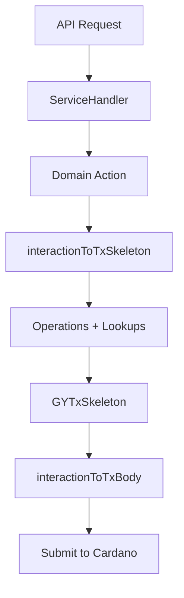

# Visualize

## Overview

Generate Mermaid diagrams to visualize data lineage, architecture, and flows in the Decentralized Belt System.

## Diagram Types

1. **Type Hierarchy Flow**
    - Show the data transformation: Transfer (API DTOs) → Domain (`Core/Types.hs`, `Core/Actions.hs`) → Onchain (`Protocol/Types.hs`, `Id.hs`)
    - Include conversion functions between layers

2. **Transaction Building Pipeline**
    - Interaction → `interactionToTxSkeleton` → Operations (Skeletons + Lookups) → `GYTxSkeleton` → `interactionToTxBody` → submitted tx

3. **Chain-Sync Event Flow**
    - Chain-sync match → `projectChainEvent` (Ingestion) → `putMatchAndProjections` (Storage) → DB rows → Query API

4. **Library Layering**
    - `onchain-lib` + `chainsync-lib` → `offchain-lib` → `webapi-lib`
    - Show which executables depend on which libraries

5. **Domain-Specific Flows**
    - Belt promotion flow: request → validation → minting → on-chain state update
    - Profile lifecycle: create → update metadata → query
    - Academy management: create → add members → promote

## Instructions

- Use Mermaid syntax (flowchart, sequence, class, or ER diagrams as appropriate)
- Keep diagrams focused — one concept per diagram
- Reference actual module names and function names from the codebase
- Output diagrams in fenced code blocks with `mermaid` language tag

## Example

