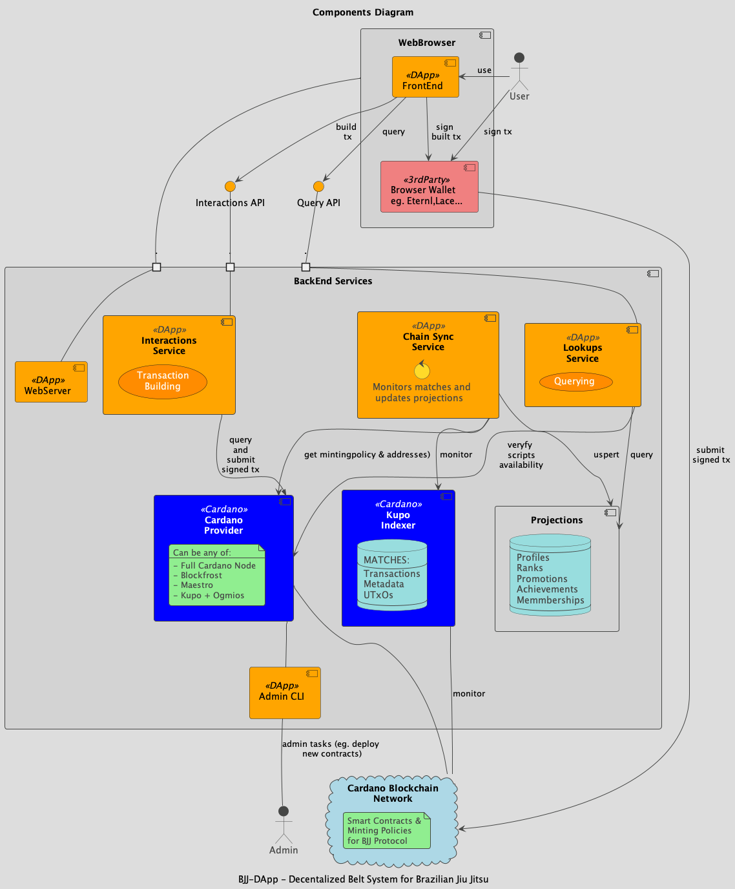
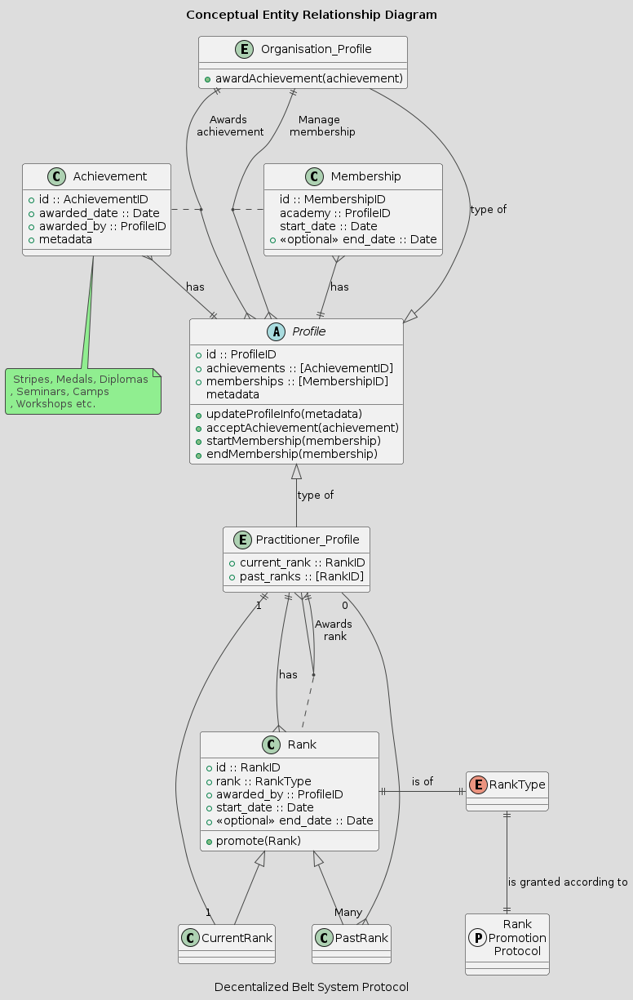
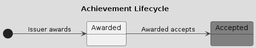
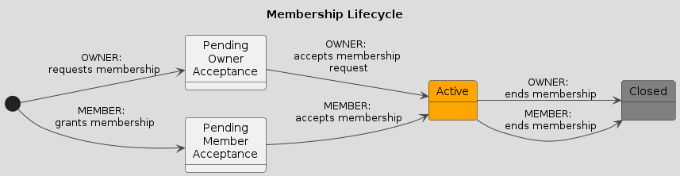
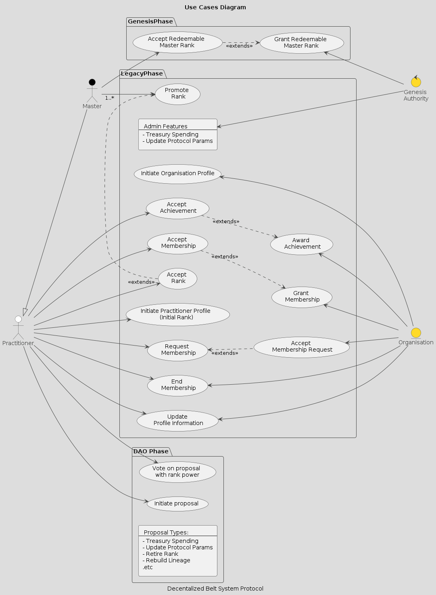
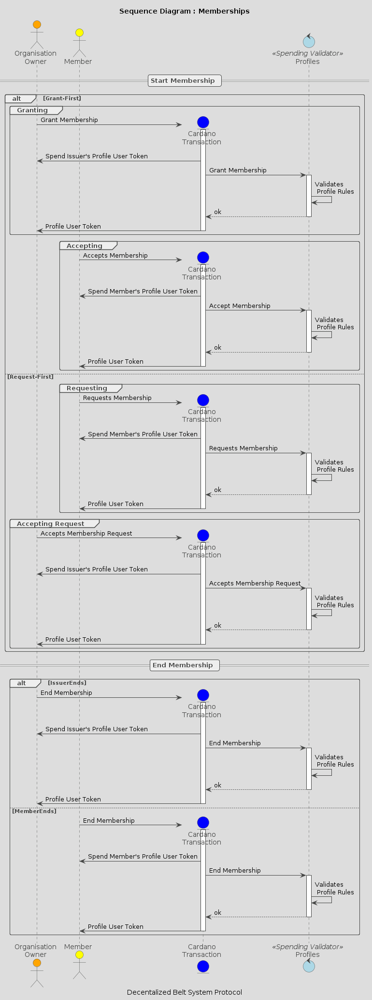

This project is part of
[F13 - Project Catalyst ID: #1300081](https://projectcatalyst.io/funds/10/f13-cardano-use-cases-concept/decentralized-belt-system-for-brazilian-jiu-jitsu-bjj-a438b)

# Decentralized Belt System for Brazilian Jiu Jitsu
- [Decentralized Belt System for Brazilian Jiu Jitsu](#decentralized-belt-system-for-brazilian-jiu-jitsu)
  - [1. Introduction](#1-introduction)
    - [1.1 Motivation](#11-motivation)
    - [1.2 Purpose](#12-purpose)
    - [1.3 Scope](#13-scope)
    - [1.4 Definitions, Acronyms, and Abbreviations](#14-definitions-acronyms-and-abbreviations)
    - [1.5 References](#15-references)
    - [1.6 Intended Audience and Reading Suggestions](#16-intended-audience-and-reading-suggestions)
    - [1.7 Objectives and Benefits](#17-objectives-and-benefits)
    - [1.8 Differentiators](#18-differentiators)
  - [2. Overview of the Decentralized Belt System](#2-overview-of-the-decentralized-belt-system)
    - [2.1 High-Level Architecture](#21-high-level-architecture)
    - [2.2 Roles and Actors](#22-roles-and-actors)
    - [2.3 General Rules](#23-general-rules)
    - [2.4 Phases](#24-phases)
      - [Genesis Phase](#genesis-phase)
      - [Legacy Phase](#legacy-phase)
      - [DAO Phase](#dao-phase)
  - [3. Use Cases](#3-use-cases)
    - [3.1 Genesis Authority](#31-genesis-authority)
    - [3.2 Master](#32-master)
    - [3.3 Practitioner](#33-practitioner)
    - [3.4 Organization](#34-organization)
    - [3.5 DAO (Decentralized Autonomous Organization)](#35-dao-decentralized-autonomous-organization)
  - [4. Detailed User Stories](#4-detailed-user-stories)
    - [4.1 Practitioner User Stories](#41-practitioner-user-stories)
    - [4.2 Master User Stories](#42-master-user-stories)
    - [4.3 Organization User Stories](#43-organization-user-stories)
  - [Conclusion](#conclusion)
  - [Annex 1: Protocol Parameters](#annex-1-protocol-parameters)
  - [Annex 2: Blockchain Representation](#annex-2-blockchain-representation)
  - [Annex 3: Protocol Promotion Rules (Simplified)](#annex-3-protocol-promotion-rules-simplified)
    - [Granting Rights](#granting-rights)

## 1. Introduction

### 1.1 Motivation

We recognize that the current BJJ system lacks a unified, transparent, and verifiable method to track practitioners’ progress and lineage. This leads to:

- **Discrepancies** in belt rankings across different academies and regions.  
- **Difficulties** in verifying a practitioner’s training history or authenticity, especially if they move or travel frequently.  
- A **fragmented** community that lacks a **decentralized mechanism** for consensus or self-sustainability.

### 1.2 Purpose

The purpose of this document is to outline the **functional requirements** and **specifications** for a decentralized application (DApp) and protocol designed to provide a unified, **transparent**, and **verifiable** method to track practitioners’ progress, lineage, and manage belt promotions, achievements, and memberships in Brazilian Jiu-Jitsu. The system leverages the **Cardano blockchain** to enhance trust, accountability, and decentralization.

### 1.3 Scope

The application described in this document (the **BJJ-DApp**) is a client that allows users to interact with a BJJ-specific configuration of the **Decentralized Belt System Protocol** (also described in this document). The protocol enables:

- **Anyone**  to verify belt rankings and lineages.  
- **Practitioners** to maintain an immutable record of ranks, achievements, and memberships.  
- **Organizations** to manage and award promotions, memberships, and achievements.  
- **Community** to self-organise and sustain with goverance mechanisms based on rank power.

### 1.4 Definitions, Acronyms, and Abbreviations

- **DApp**: Decentralized Application  
- **DAO**: Decentralized Autonomous Organization 

### 1.5 References

- [IBJJF – Graduation System / Belt Rankings](https://ibjjf.com/graduation-system)
- [Cardano Documentation](https://docs.cardano.org/)

### 1.6 Intended Audience and Reading Suggestions

- **BJJ practitioners** looking for an immutable record of their rank progress  
- **BJJ instructors/masters** needing a tamper-proof system to manage promotions  
- **Academies/DOJOs/Organizations** wanting to grant memberships or achievements to their members  
- **Developers** interested in blockchain-based solutions for sports or martial arts  

### 1.7 Objectives and Benefits

The system seeks to:

- **Ensure transparency** in rank progression and lineage  
- **Facilitate trust** among practitioners, organizations, and the community  
- Provide a **sustainable governance model** for the BJJ community  
- Leverage the **security** and **scalability** of Cardano

### 1.8 Differentiators

- Built on the **Cardano** blockchain, ensuring low-cost transactions, high security, and global reach  
- **Rank-weighted voting** for DAO governance, allowing senior practitioners more influence in protocol decisions
- **Self-Sustainability**: Unlike traditional systems that rely on external funding or central oversight, this protocol automatically accumulates fees (e.g., from rank promotions, memberships, or achievements) into a community treasury. Through its DAO governance mechanisms, the entire BJJ community decides how to allocate these funds—enabling self-sustaining support for initiatives that benefit practitioners, academies, and organizations.

---

## 2. Overview of the Decentralized Belt System 

### 2.1 High-Level Architecture 

> - **Web Browser**  
>   - **BJJ-DApp Frontend**: The web interface for practitioners, masters, and organizations.  
>   - **3rd Party Browser Wallet** (e.g., Eternl, Lace): For signing transactions.
> - **Backend**  
>   - **Interactions Service**: Builds transactions for promotions, achievements, membership.  
>   - **Chain Sync Service**: Monitors the Cardano blockchain for updates.  
>   - **Lookups Service**: Provides quick queries for ranks, achievements, etc.  
>   - **Cardano Node**: Submits signed transactions to the Cardano network.
> - **Persistence** : A database or index for quick lookups of ranks, achievements, memberships (off-chain).

### 2.2 Roles and Actors

- **Practitioner**: An individual which is/was actively engaged the discipline.  
- **Master**: A practitioner with authority to promote other practitioners.
- **Organization**: An entity (e.g.,federation / academy / dojo / event organiser) that can grant memberships and award achievements to practitioners or other organisations.
- **Genesis Authority**: The initial authority that bootstraps the system, mints and distributes the initial redeemable Master-Rank vouchers, and oversees protocol parameters in the Legacy Phase (before DAO control)  .
- **DAO**: The governing body of the system post-decentralization (DAO Phase)

### 2.3 General Rules

**Profile**: Entity representing a user or organization in the system. There will be two types of profiles: 
   - **Practitioner Profile**: Holds current rank, past ranks, achievements, memberships (active and closed). Practitioner profiles will be able to promote ranks of other practitioners profiles based on the [Protocol Promotion Rules](#annex-3-protocol-promotion-rules-simplified).  
   - **Organization Profile**: Can grant memberships and award achievements to practitioners or other organisations. Organisation profiles can also hold achievements and memberships.

- 

### 2.4 Phases

> **Disclaimer**  
> This phase is not part of the scope of proposal 1300081. The DAO Phase is beyond the initial scope; it’s included in the documentation to outline the long-term vision and ensure the initial architectural design can accommodate these capabilities later on. Documenting future development also reduces ambiguity about the project’s ultimate goals.
>

#### Genesis Phase  
In this phase, the **Genesis Authority** will identify current active Masters from existing public information, will mint and send personalized vouchers to each of the Masters so that they could redeem their ranks.

The vouchers will have an expiration date after which will no longer be redeemable. This date will also mark the end of the Genesis Phase.

#### Legacy Phase

This phase starts **simultaneously** with the Genesis Phase and will enable the  **core features**: profiles, ranks, memberships and achievements management.  

During this phase **Protocol parameters** and **administrative features** are controlled by the **Genesis Authority**  

  
#### DAO Phase 

In the DAO phase all **core features** of the Legacy Phase remain available but the **administrative control** transitions from **Genesis Authority** to a **DAO**  and all the governance decisions (treasury spending, parameter changes, etc.) will happen via **rank-weighted** voting.

---

## 3. Use Cases

### 3.1 Genesis Authority

1. **Grant Redeemable Master Rank**  
   - **Goal**: Issue redeemable vouchers to recognized Masters. These vouchers represent their rank and allow them to onboard into the system during the Genesis Phase.
   - **Precondition**: Verified list of existing Masters and their contact information.
   - **Postcondition**: Masters receive vouchers representing their rank

2. **Treasury Spending**  
   - **Goal**: The Genesis Authority can spend treasury funds during the Legacy Phase for various protocol needs (e.g., marketing, development, operational expenses).
.
   - **Precondition**:
       - The system is in the **Legacy Phase**, and the GA still holds administrative privileges.  
       - Sufficient funds have accumulated in the treasury from onboarding, promotion, and achievement fees.

   - **Postcondition**: 
     - The treasury funds are **deducted** from the Treasury contract
     - The spending record is **immutably stored** on-chain, accessible for future auditing and transparency.

1. **Updating Protocol Parameters**  
   - **Goal**: The Genesis Authority can **configure or update** certain parameters (e.g., fees, rules for promotions, maximum membership duration) as needed before the system transitions to DAO control.
.
   - **Precondition**: The system is in the **Legacy Phase**, and the GA still holds administrative privileges.  

   - **Postcondition**:The **updated parameters** take effect immediately.

### 3.2 Master

1. **Accept Redeemable Master Rank**  
   - **Goal**: Redeem a voucher to claim Master rank in the system.  
   - **Precondition**: Master has received a valid voucher  
   - **Postcondition**: Practitioner Profile is created/updated with Master rank

2. **Promote Rank**  
   - **Goal**: Promote practitioners to higher ranks  
   - **Precondition**: 
     - Practitioner profile exists
     - Master's profile exists and it's rank is recognized by the protocol  
   - **Postcondition**: Rank promotion authization is reflected on-chain

### 3.3 Practitioner

1. **Initiate Practitioner Profile**  
   - **Goal**: Create a profile and initialize it with a starting rank (e.g., white belt)  
   - **Precondition**: None
   - **Postcondition**: Practitioner’s on-chain profile is created

2. **Update Profile Information**  
   - **Goal**: Update personal details (academy, metadata, etc.)  
   - **Precondition**: Profile exists 
   - **Postcondition**: Profile reflects the new information on-chain

3. **Accept Achievement**  
   - **Goal**: Accept an achievement (competition medals, seminar attendance, stripes, etc.)  
   - **Precondition**: Organization has awarded the achievement  
   - **Postcondition**: Practitioner’s achievements list is updated
  

4. **Accept Rank**  
   - **Goal**: Accept a promotion from a Master  
   - **Precondition**: A Master has granted a promotion  
   - **Postcondition**: Practitioner’s rank record is updated

5. **Accept Membership**  
   - **Goal**: Accept a membership offered by an Organization  
   - **Precondition**: Organization has granted membership  
   - **Postcondition**: Practitioner’s membership list is updated

6. **Request Membership**  
   - **Goal**: Request membership from an Organization  
   - **Precondition**: Practitioner has an existing profile  
   - **Postcondition**: Membership request is reflected on-chain

7. **End Membership**  
   - **Goal**: Terminate an existing membership  
   - **Precondition**: Membership is active 
   - **Postcondition**: Membership is marked as ended, with the end date on-chain
  

### 3.4 Organization

1. **Initiate Organization Profile**  
   - **Goal**: Create an Organization Profile to manage memberships/achievements  
   - **Precondition**: None
   - **Postcondition**: Organization’s on-chain profile is created

2. **Update Profile Information**  
   - **Goal**: Update organizational details  
   - **Precondition**: Profile exists
   - **Postcondition**: Organization's profile reflects the new information on-chain

3. **Grant Membership**  
   - **Goal**: Offer memberships to practitioners or other organizations  
   - **Precondition**: Organisation exists, member's profile exists.
   - **Postcondition**: Membership is pending acceptance

4. **End Membership**  
   - **Goal**: Terminate an existing membership  
   - **Precondition**: Membership is active 
   - **Postcondition**: Membership is marked as ended, with the end date on-chain

5. **Award Achievement**  
   - **Goal**: Grant achievements (seminars, camps, medals, stripes) 
   - **Precondition**: Organisation exists, member's profile exists. 
   - **Postcondition**: Practitioner’s achievement list is updated

### 3.5 DAO (Decentralized Autonomous Organization)

> **Disclaimer**  
> This phase is not part of the scope of proposal 1300081.
> 
1. **Initiate Governance Proposal**  
   - **Goal**: Propose changes to protocol parameters or treasury spending  
   - **Precondition**: DAO Phase has begun
   - **Postcondition**: Proposal is open for discussion and voting

2. **Vote on Proposal with Rank Power**  
   - **Goal**: Vote on proposals using rank-weighted power  
   - **Precondition**: A proposal is active 
   - **Postcondition**: Proposal passes or fails based on voting results

---

## 4. Detailed User Stories

### 4.1 Practitioner User Stories

1. **Onboarding / Profile Creation**  
   - **As a practitioner**, I want to create my profile so that I have an on-chain identity to track my rank and history.  
   - **Acceptance Criteria**:  
     - Practitioner can mint a “Profile NFT.”  
     - Initial rank is assigned (e.g., White Belt).  
     - Profile is visible in on-chain explorer.

2. **View Progress & Lineage**  
   - **As a practitioner**, I want to view my entire promotion history (current and past ranks) so I can see how I’ve progressed over time.  
   - **Acceptance Criteria**:  
     - System displays a chronological list of ranks and awarding authority.  
     - Achievements/memberships are listed in the timeline.

3. **Update Profile Info**  
   - **As a practitioner**, I want to update my profile (e.g., if I switch academies or add a new affiliation) so that the system accurately reflects my current status.  
   - **Acceptance Criteria**:  
     - Profile NFT can be updated with new metadata.  
     - Only the profile owner can authorize changes.

4. **Accept a Promotion**  
   - **As a practitioner**, I want to confirm a new rank from a Master so that it becomes valid on the blockchain.  
   - **Acceptance Criteria**:  
     - Master can initiate the rank promotion.  
     - Practitioner can accept.  
     - On-chain record updates “current_rank” and “past_ranks.”

5. **Accept a Membership**  
   - **As a practitioner**, I want to accept membership from an organization so that I can be recognized as part of that group.  
   - **Acceptance Criteria**:  
     - Organization initiates membership creation.  
     - Practitioner signs membership acceptance.  
     - Membership is added to practitioner profile.

6. **Request Membership**  
   - **As a practitioner**, I want to request membership to an organization so that I can officially join them on-chain.  
   - **Acceptance Criteria**:  
     - Practitioner initiates request transaction.  
     - Organization must confirm acceptance.

7. **Accept an Achievement**  
   - **As a practitioner**, I want to add achievements (diplomas, medals, etc.) to my record so I can showcase them publicly.  
   - **Acceptance Criteria**:  
     - Organization issues the achievement.  
     - Practitioner confirms.

8. **End Membership**  
   - **As a practitioner**, I want to end membership with an organization so that my profile accurately reflects my current affiliations.  
   - **Acceptance Criteria**:  
     - Practitioner or Organization ends membership.  
     - End date is recorded on-chain.

### 4.2 Master User Stories

1. **Redeem Master Voucher**  
   - **As a master**, I want to redeem my master-rank voucher so that my rank is recognized on-chain.  
   - **Acceptance Criteria**:  
     - Voucher is valid and unexpired.  
     - Master’s profile is created/updated with the recognized rank.

2. **Promote Practitioners**  
   - **As a master**, I want to promote students to higher ranks so that their progress is recognized.  
   - **Acceptance Criteria**:  
     - Master’s rank must be high enough for the target promotion.  
     - Practitioner must confirm acceptance.  
     - Rank record is permanently updated on the practitioner’s profile.

3. **Award Achievements**  
   - **As a master**, I want to award stripes or other achievements to students so their progress is recognized between belt promotions.  
   - **Acceptance Criteria**:  
     - Master can create an achievement record.  
     - Practitioner confirms acceptance.

### 4.3 Organization User Stories

1. **Create an Organization Profile**  
   - **As an organization**, I want to create an on-chain profile so that I can manage memberships and grant achievements.  
   - **Acceptance Criteria**:  
     - Organization NFT is minted.  
     - Profile details are recorded.

2. **Grant Membership**  
   - **As an organization**, I want to offer membership to practitioners so that they can officially be affiliated with my academy.  
   - **Acceptance Criteria**:  
     - Membership is granted by the organisation
     - Practitioner must accept.  
     - Membership details (start date, membership type) are added to the practitioner’s profile.

3. **Accept Membership Request**  
   - **As an organization**, I want to approve membership requests 
   - **Acceptance Criteria**:  
     - Membership is accepted by the organisation
     - Membership details (start date, membership type) are added to the practitioner’s profile.

4. **Award Achievements**  
   - **As an organization**, I want to grant achievements (eg. medals , diplomas) so that practitioners can record them.  
   - **Acceptance Criteria**:  
     - Achievement transaction is created by the organization.  
     - Practitioner accepts to finalize.

5. **Update Organization Profile**  
   - **As an organization**, I want to update my profile so that the information remains current.  
   - **Acceptance Criteria**:  
     - Profile NFT can be updated with new metadata.  
     - Only the profile owner can authorize changes.

## Conclusion

This **Decentralized Belt System** aims to bring **trust, transparency, and sustainability** to the Brazilian Jiu-Jitsu community by recording ranks, achievements, and memberships on the **Cardano blockchain**. 

> **Next Steps**  
> - Finalize the **on-chain** implementations (minting logic, membership acceptance, rank promotions)  
> - Finalize the **off-chain** implementation and the BJJ Decentralized Belt System **Website**  
> - Conduct **testnet** deployments to gather user feedback  
> - Onboard pilot academies/masters to validate real-world usage

**End of Document**

---

## Annex 1: Protocol Parameters

- **Genesis Authority Public Key**  
- **Genesis Phase End Date**  
- **Fees**  
  - Onboarding Fee  
  - Promotion Fee  
  - Achievement Issue Fee

---

## Annex 2: Blockchain Representation 

- **Profile**: Each profile (practitioner or organization) is represented :
  - A reference NFT locked in a contract that controls the lifecycle.
  - An (associated) user NFT of the owner through which various actions will be authorized.
- **Rank** : Each rank is represented as an NFT locked in a contract that controls the lifecycle.
- **Achievements and Memberships**: Represented by on-chain transactions referencing the profile NFT

---

## Annex 3: Protocol Promotion Rules (Simplified)

The promotion mechanism for belts and stripes considers:

- **Practitioner’s age** (e.g., children vs. adult belt progression)  
- **Time spent at current rank** (minimum months/years at a rank)  
- **Rank of the person granting the promotion** (brown belts can only promote up to certain ranks, black belts have broader powers, etc.)

### Granting Rights

- **Anyone** → White Belt  
- **Brown Belt** → Stripes for (White – Purple) belts  
- **Black Belt** → Belt promotions from Blue up to Brown, plus stripes at all those belt levels  

> _(Exact rules for stripes, promotions, and time-in-rank can be adjusted in the final protocol parameters.)_

---
