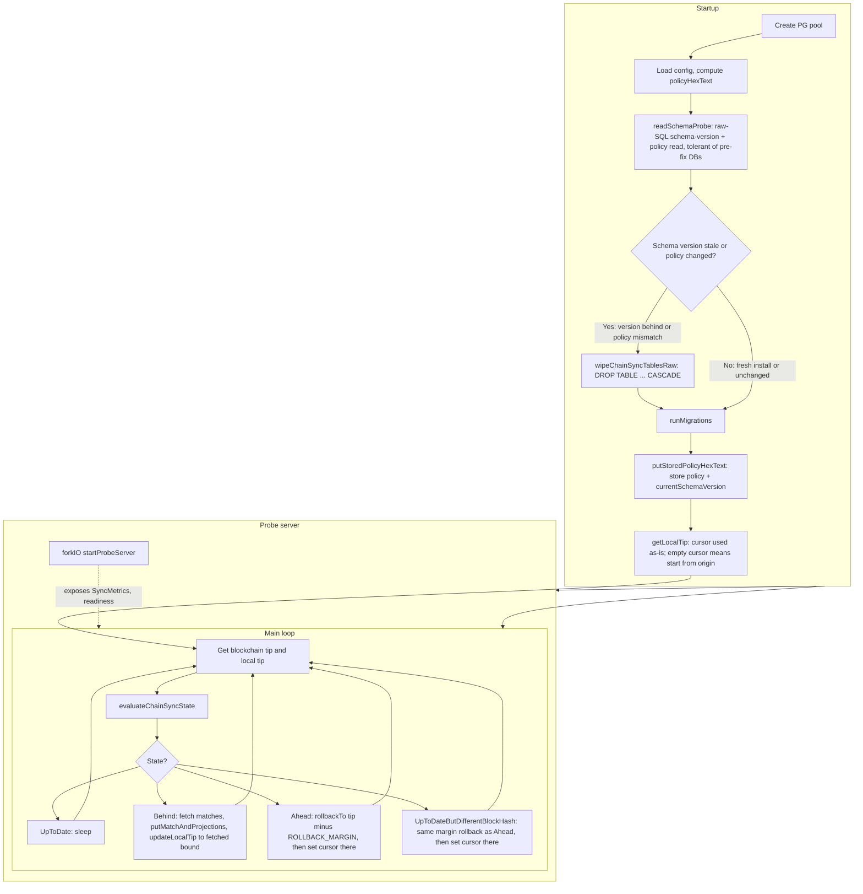

# ChainSync Documentation

*Audience: operators, integrators, and anyone debugging stale projections. Covers what the ChainSync service does, its consistency model, and how it handles reorgs. See [`../onchain-architecture.md`](../onchain-architecture.md) for the on-chain events it consumes and [`../../.cursor/rules/operations/storage-ingestion.mdc`](../../.cursor/rules/operations/storage-ingestion.mdc) for the offchain projection pipeline.*

This document explains what the ChainSync process does and why it works the way it does.

---

## What problem it solves

You have **off-chain state** (Postgres: profiles, ranks, memberships, achievements, etc.) that must **track the chain**: every relevant on-chain event (outputs under your minting policy) should be reflected in the DB, and the DB should never claim to be ahead of the real chain.

So the ChainSync process has two jobs:

1. **Ingest**: turn “things that happened on chain” into stored events and derived projections.
2. **Stay consistent**: keep a single “we’ve processed up to here” cursor and handle reorgs (rollback when local state is ahead or on a different block at the same slot).

---

## Overview diagram

The following diagram summarizes startup (including policy check and optional wipe), the probe server, and the main sync loop.

---

## Why it works this way

### Schema-version + policy check at startup

- **What**: Before migrations run, `readSchemaProbe` reads the schema version and minting policy hex from `chain_sync_config` via raw, schema-tolerant SQL (it works even against a pre-fix DB where the `schema_version` column, or the table itself, doesn't exist yet). If the table is absent, this is a fresh install. If the stored schema version is behind `currentSchemaVersion`, or the stored policy differs from the current one, the process runs `wipeChainSyncTablesRaw` (a raw `DROP TABLE ... CASCADE` over every chain-sync table, **no migration call**) before `runMigrations`. Only after that does `runMigrations` run, and `putStoredPolicyHexText` unconditionally (re)writes the current policy and schema version. The local cursor is then used as-is: an empty cursor (fresh install, or right after a wipe) is slot 0 with an empty header, which the sync loop treats as "start from origin."
- **Why**: Two independent triggers need the same remedy — a **schema change** (e.g. this branch's `bigint` slot columns and 4-field raw-match key) and a **minting-policy change** (redeploying the policy invalidates previously-indexed data) both require a clean rebuild. Probing and wiping **before** migration matters mechanically: persistent's auto-migration treats a `varchar → bigint` type change or a `NOT NULL` column add as a "safe" in-place `ALTER`, and Postgres rejects those against a populated pre-fix table (no `USING` clause, no default) — wiping first means `runMigrations` only ever `CREATE`s fresh tables, never runs an incompatible `ALTER`.

### Single cursor (local tip)

- **What**: One “chain cursor” in the DB: slot number + block header hash.
- **Why**: So you have a single, clear definition of “we have applied all matches up to and including this block.” The query API can then answer “what’s the chain state we’re reflecting?” and “are we up to date?” from that one place.

### Kupo as the chain view

- **What**: Chain tip and matches come from Kupo (HTTP API), not a full node.
- **Why**: Kupo indexes the chain and exposes “matches” (e.g. outputs by policy). You get “what happened in this slot range for this policy” without running a node or implementing chain sync yourself. The process is “cursor vs Kupo tip” and “fetch matches from Kupo, apply to DB.”

### Starting from origin, not a forward-walked checkpoint

- **What**: There is no startup checkpoint-alignment step. The process reads the local cursor as-is (`getLocalTip`): a non-empty cursor is used unchanged; an empty cursor (fresh install, or right after a schema/policy wipe) is slot 0 with an empty header. The main loop then treats slot 0 as `Behind`, and the first `Behind` fetch requests matches with `created_after = 0`, i.e. everything Kupo has indexed for the configured match pattern.
- **Why**: The process used to forward-walk from the cursor in large (default 100,000,000-slot) steps looking for a Kupo checkpoint, using Kupo's non-strict `GET /checkpoints/{slot}` (which returns the *largest checkpoint ≤* the requested slot). On an empty cursor this pinned the cursor near the chain tip and silently skipped almost all history — a real bug (F-04), not a deliberate checkpoint-alignment feature. Kupo's match-fetching endpoints do not require the cursor to sit on a specific checkpoint boundary; starting from slot 0 (bounded by Kupo's own `--since` configuration) is sufficient and correct.

### Four sync states and what each does

The loop compares **local tip** (DB cursor) vs **blockchain tip** (Kupo) and branches:

1. **UpToDate** (same slot, same header)
   - **What**: Do nothing, sleep, repeat.
   - **Why**: There is no new chain to process; sleeping avoids hammering Kupo and the DB.

2. **Behind** (local slot < chain slot)
   - **What**: Fetch matches from Kupo in batches from local tip to chain tip; for each match run `putMatchAndProjections` (store event + update projections); then move the cursor to the chain tip.
   - **Why**: New blocks have been produced; you must pull every relevant event in that range and apply it so projections (profiles, ranks, memberships, etc.) stay correct. Batching keeps memory and request size bounded.

3. **Ahead** (local slot > chain slot)
   - **What**: Roll back to `max 0 (chainTipSlot - ROLLBACK_MARGIN)` (`rollbackTo networkId rollbackSlot`, §"Rollback" below), then set the cursor explicitly to `(rollbackSlot, "")`.
   - **Why**: The chain has reorged or been rolled back; your DB must not keep state "beyond" the real chain. Rolling back only to the reported chain tip would leave stale rows from the abandoned fork below that point if the fork went deeper than one block, so the process rolls back an additional safety margin (`ROLLBACK_MARGIN`, default 2160 slots) and lets the next `Behind` cycle re-sync forward and heal.

4. **UpToDateButDifferentBlockHash** (same slot, different header)
   - **What**: Same remedy as `Ahead`: roll back to `max 0 (chainTipSlot - ROLLBACK_MARGIN)`, set the cursor to `(rollbackSlot, "")`, and let the normal forward-sync loop re-fetch and heal.
   - **Why**: Reorg at the tip: the chain replaced the block at that slot, so any rows derived from the orphaned block are phantom data. The previous behavior only updated the cursor to the new tip and left those phantom rows in place — that was the bug this branch fixes (a same-slot-different-hash divergence must trigger a real rollback, not just a cursor bump). Clamping `ROLLBACK_MARGIN` to a minimum of 1 guarantees `rollbackSlot < chainTipSlot`, so the next loop iteration is `Behind` (a plain slot comparison) rather than looping on the same equal-slot divergence forever.

So functionally: **UpToDate** = idle; **Behind** = catch up by ingesting; **Ahead** and **UpToDateButDifferentBlockHash** = repair by rolling back (with a safety margin) and letting the loop re-sync forward.

### Rollback: what gets removed, and why it replays instead of just deleting

- **What**: `rollbackTo networkId slotNo` takes only a slot (no header). It (1) deletes raw on-chain match events with slot > `slotNo`; (2) wipes every derived projection table (profiles, ranks, promotions, memberships, achievements) completely; (3) replays the *surviving* raw-match log — everything at or below `slotNo` — back through the same projection logic used during normal sync (`projectAndStore`), in true chain order `(slot, transaction_index, output_index)`.
- **Why**: Projection tables are destructive upserts keyed by entity id — the row only ever reflects the *latest* event applied to that entity, not its history. So a plain "delete rows above the rollback slot" (the old behavior) is wrong whenever an entity was created at some slot S0 and later mutated at a slot S2 that has since been rolled back past: the row's `createdAtSlot` is S2, so a rollback to S1 (S0 < S1 < S2) would delete the *entire* row, and nothing would recreate it — the raw match that created it at S0 is below the rollback point and Kupo will never re-send it. The same problem applies to `deletePromotionProjection`: if the rank-confirming match that deleted a promotion projection turns out to be on an orphaned fork, plain deletion can't restore the promotion. Replaying the whole surviving raw-match log from scratch avoids all of this: every entity's current projection state is rebuilt purely from matches that are still known to be on-chain, in the order they actually occurred, which is exactly what makes `deletePromotionProjection` fire (or not fire) correctly. This is why raw match order must be true chain order and not, e.g., `transaction_id` (a hash, not a sequence number) — see `replayOrder` in `Storage.hs`. The no-header, slot-only signature is safe because every caller (`Ahead`, `UpToDateButDifferentBlockHash`) passes a slot strictly below any possible orphaned block, guaranteed by the `ROLLBACK_MARGIN ≥ 1` clamp above.
- **Cost**: This rebuilds all projections on every rollback, not just the affected rows. Rollbacks are rare and this protocol's match volume is small, so full rebuild is chosen for provable correctness over a targeted (and much more complex) partial rebuild. Documented as a future optimization if match volume grows.

### Probe server (health / readiness)

- **What**: HTTP server exposing metrics (local tip, chain tip, sync state, last sync time) and a “ready” endpoint that returns 503 when sync is not in a “good” state (e.g. Ahead, Behind True, UpToDateButDifferentBlockHash).
- **Why**: Orchestrators (Kubernetes, etc.) can health-check the process and route traffic only when the DB is “up to date” or “slightly behind,” and avoid using it during rollback or when it’s far behind.

### Why “Behind” is split (way behind vs not)

- **What**: `Behind` carries `isWayBehind` (e.g. true when slot gap > 1200). The readiness probe treats “Behind False” as ready and “Behind True” as not ready (503).
- **Why**: When only a bit behind, the DB is still a reasonable view of the chain for reads; when far behind, you don’t want clients to treat the service as ready until it has caught up more.

---

## Summary

**Functionally**, ChainSync keeps a single DB cursor aligned with the chain, **ingests** on-chain events (via Kupo) into the DB and updates projections when **behind**, **rolls back and replays** when **ahead** or on a wrong block, and **exposes health/readiness** so the rest of the system can depend on “DB reflects chain up to tip” when the probe says ready. At startup, a **schema-version + policy check** (`readSchemaProbe`) determines whether chain-sync tables need wiping *before* migrations run: fresh installs and unchanged schema/policy skip the wipe; a stale schema version or a changed policy triggers `wipeChainSyncTablesRaw` first, so migration only ever creates fresh tables. The cursor is then used as-is — an empty cursor simply means "start syncing from origin."
