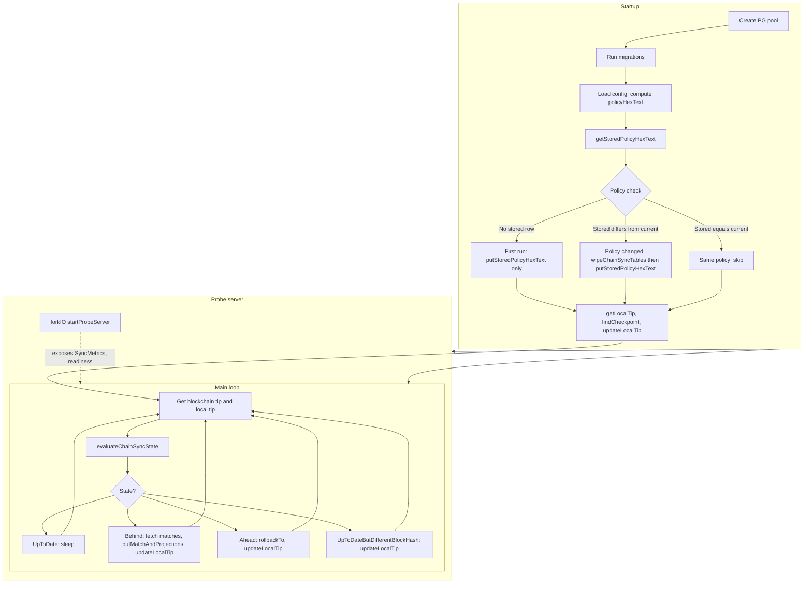

# ChainSync Documentation

This document explains what the ChainSync process does and why it works the way it does.

---

## What problem it solves

You have **off-chain state** (Postgres: profiles, ranks, memberships, achievements, etc.) that must **track the chain**: every relevant on-chain event (outputs under your minting policy) should be reflected in the DB, and the DB should never claim to be ahead of the real chain.

So the ChainSync process has two jobs:

1. **Ingest**: turn “things that happened on chain” into stored events and derived projections.
2. **Stay consistent**: keep a single “we’ve processed up to here” cursor and handle reorgs (rollback when local state is ahead or on a different block at the same slot).

---

## Overview diagram

The following diagram summarizes startup (including policy check and optional wipe), the probe server, and the main sync loop.

---

## Why it works this way

### Policy check at startup

- **What**: The minting policy hex (from deployed validators config) is stored in a singleton table (`chain_sync_config`). At startup the process reads the stored value and compares it to the current config. **First run** (no stored row): the process only writes the current policy; it does not wipe. **Policy changed** (stored value differs from current): the process wipes all chain-sync tables, re-runs migrations, writes the current policy, then aligns the cursor so sync starts from a clean state. **Same policy**: no wipe, no write; startup continues with existing cursor and data.
- **Why**: If you redeploy the minting policy (e.g. after a protocol upgrade), the new policy hash would not match the old one. Data indexed under the old policy would be invalid for the new one. Wiping on change ensures the DB only reflects the current policy. On first run the tables are already empty, so wiping would be redundant.

### Single cursor (local tip)

- **What**: One “chain cursor” in the DB: slot number + block header hash.
- **Why**: So you have a single, clear definition of “we have applied all matches up to and including this block.” The query API can then answer “what’s the chain state we’re reflecting?” and “are we up to date?” from that one place.

### Kupo as the chain view

- **What**: Chain tip and matches come from Kupo (HTTP API), not a full node.
- **Why**: Kupo indexes the chain and exposes “matches” (e.g. outputs by policy). You get “what happened in this slot range for this policy” without running a node or implementing chain sync yourself. The process is “cursor vs Kupo tip” and “fetch matches from Kupo, apply to DB.”

### Checkpoint alignment at startup

- **What**: Before the main loop, you take the current DB cursor (or 0), find a **Kupo checkpoint** at or after that slot, and set the DB cursor to that checkpoint.
- **Why**: Kupo only gives you matches between **checkpoints**. So your cursor must sit on a checkpoint. If the DB had “slot 1,000,000” but Kupo’s checkpoints are 1,000,000 and 1,001,000, you align to one of those so the next “fetch matches from cursor to tip” call is valid.

### Four sync states and what each does

The loop compares **local tip** (DB cursor) vs **blockchain tip** (Kupo) and branches:

1. **UpToDate** (same slot, same header)
   - **What**: Do nothing, sleep, repeat.
   - **Why**: There is no new chain to process; sleeping avoids hammering Kupo and the DB.

2. **Behind** (local slot < chain slot)
   - **What**: Fetch matches from Kupo in batches from local tip to chain tip; for each match run `putMatchAndProjections` (store event + update projections); then move the cursor to the chain tip.
   - **Why**: New blocks have been produced; you must pull every relevant event in that range and apply it so projections (profiles, ranks, memberships, etc.) stay correct. Batching keeps memory and request size bounded.

3. **Ahead** (local slot > chain slot)
   - **What**: Rollback DB: delete events and projections strictly after the chain tip (and at the tip if header differs); set cursor to chain tip.
   - **Why**: The chain has reorged or been rolled back; your DB must not keep state “beyond” the real chain. Rolling back to the chain tip restores the invariant “DB state = chain state up to tip.”

4. **UpToDateButDifferentBlockHash** (same slot, different header)
   - **What**: Only update the cursor to the chain tip (same slot, new header).
   - **Why**: Reorg at the tip: the chain replaced the block at that slot. You may have already applied the old block; you don’t re-fetch matches for that slot here, you just accept the new tip so the next iteration can be Behind/UpToDate. If you had applied the wrong block, a fuller rollback would require “Behind” or “Ahead” logic; this branch is the minimal fix when only the tip block changed.

So functionally: **UpToDate** = idle; **Behind** = catch up by ingesting; **Ahead** = repair by rolling back; **UpToDateButDifferentBlockHash** = fix cursor after a tip reorg.

### Rollback: what gets removed and why

- **What**: `rollbackTo slotNo headerHash` deletes:
  - All on-chain match events with slot > `slotNo`, or slot == `slotNo` but header ≠ `headerHash`.
  - All projection rows (profiles, ranks, memberships, achievements, etc.) with the same conditions (slot > tip, or same slot / wrong hash).
- **Why**: Those rows were derived from blocks that are no longer on the chain (or from the wrong block at that slot). Keeping them would make the DB state not match the chain. Removing them keeps the invariant “every row corresponds to a block that is (or was) on the chain at the cursor.”

### Probe server (health / readiness)

- **What**: HTTP server exposing metrics (local tip, chain tip, sync state, last sync time) and a “ready” endpoint that returns 503 when sync is not in a “good” state (e.g. Ahead, Behind True, UpToDateButDifferentBlockHash).
- **Why**: Orchestrators (Kubernetes, etc.) can health-check the process and route traffic only when the DB is “up to date” or “slightly behind,” and avoid using it during rollback or when it’s far behind.

### Why “Behind” is split (way behind vs not)

- **What**: `Behind` carries `isWayBehind` (e.g. true when slot gap > 1200). The readiness probe treats “Behind False” as ready and “Behind True” as not ready (503).
- **Why**: When only a bit behind, the DB is still a reasonable view of the chain for reads; when far behind, you don’t want clients to treat the service as ready until it has caught up more.

---

## Summary

**Functionally**, ChainSync keeps a single DB cursor aligned with the chain, **ingests** on-chain events (via Kupo) into the DB and updates projections when **behind**, **rolls back** when **ahead** or on a wrong block, and **exposes health/readiness** so the rest of the system can depend on “DB reflects chain up to tip” when the probe says ready. At startup, a **policy check** ensures the stored minting policy hex matches the current config: first run only stores the policy (no wipe); if the policy changed, chain-sync tables are wiped and recreated before syncing.
