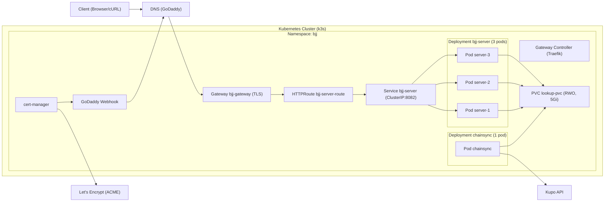

### Ghid complet de deploy și operare pe k3s (începător)

Acest ghid te duce de la zero până la un deployment HTTPS funcțional, explică fiecare manifest Kubernetes din `k8s/`, ce comenzi rulezi și de ce, plus cum monitorizezi și operezi serviciile zilnic.

## 0) Precondiții
- kubeconfig pentru clusterul minirack: `/Users/mg/kubeconfigs/minirack.yaml`
- DNS pentru `bjjbackend.cardano.vip` gestionat în GoDaddy
- imagini Docker:
  - `mariusgeorgescu/chainsync:chainsync`
  - `mariusgeorgescu/bjjserver:chainsync`

Setează contextul:
```bash
export KUBECONFIG=/Users/mg/kubeconfigs/minirack.yaml
kubectl get nodes -o wide
```

## 1) Instalare cert-manager (emite și reînnoiește certificate TLS)
- ce este: controller care gestionează automat certificate TLS (Let’s Encrypt)
- de ce: Expunerea HTTP(S) cere TLS; cert-manager emite și reînnoiește automat
```bash
helm repo add jetstack https://charts.jetstack.io
helm repo update
helm upgrade --install cert-manager jetstack/cert-manager \
  -n cert-manager --create-namespace --set crds.enabled=true

kubectl -n cert-manager rollout status deploy/cert-manager
kubectl -n cert-manager rollout status deploy/cert-manager-cainjector
kubectl -n cert-manager rollout status deploy/cert-manager-webhook
```

## 2) Instalare webhook GoDaddy (pentru challenge DNS‑01)
- ce este: extensie pentru cert-manager care creează automat TXT record în GoDaddy
- de ce: DNS‑01 funcționează chiar dacă portul 80 nu e accesibil din exterior
```bash
helm repo add godaddy-webhook https://snowdrop.github.io/godaddy-webhook
helm repo update
helm upgrade --install acme-godaddy-webhook godaddy-webhook/godaddy-webhook \
  -n cert-manager --create-namespace --set groupName=acme.mycompany.com

kubectl -n cert-manager wait --for=condition=available --timeout=120s deploy/acme-godaddy-webhook
```

## 3) Secret cu token-ul GoDaddy (autentificare)
- nume: `godaddy-api-token` în `cert-manager`
- cheie: `token` cu valoarea `API_KEY:API_SECRET`
```bash
kubectl -n cert-manager create secret generic godaddy-api-token \
  --from-literal=token='<GODADDY_API_KEY>:<GODADDY_API_SECRET>'
```

## 4) Issuers (cine emite certificatele)
- fișiere: `clusterissuer-godaddy-staging.yaml` (test), `clusterissuer-godaddy-prod.yaml` (producție)
```bash
kubectl apply -f k8s/clusterissuer-godaddy-staging.yaml
kubectl apply -f k8s/clusterissuer-godaddy-prod.yaml
kubectl get clusterissuers
```

## 5) Namespace pentru aplicație
- fișier: `namespace.yaml`
```bash
kubectl apply -f k8s/namespace.yaml
```

## 6) Activare Gateway API în Traefik (o singură dată)
- Creează `GatewayClass` pentru Traefik și dă permisiuni pentru Gateway API:
```bash
kubectl apply -f k8s/gatewayclass-traefik.yaml
kubectl apply -f k8s/traefik-gateway-rbac.yaml
```
- Activează providerul Gateway și intrările 80/443; apoi aliniază Service-ul Traefik (dacă e nevoie):
```bash
# adaugă providerul Gateway
kubectl -n kube-system patch deploy/traefik --type='json' \
  -p='[{"op":"add","path":"/spec/template/spec/containers/0/args/-","value":"--providers.kubernetesgateway"}]'

# schimbă entryPoints pe 80/443
kubectl -n kube-system patch deploy/traefik --type='json' \
  -p='[{"op":"replace","path":"/spec/template/spec/containers/0/args/4","value":"--entryPoints.web.address=:80/tcp"},
      {"op":"replace","path":"/spec/template/spec/containers/0/args/5","value":"--entryPoints.websecure.address=:443/tcp"}]'

kubectl -n kube-system rollout status deploy/traefik

# dacă Service-ul Traefik țintește porturi denumite (web/websecure), aliniază targetPort la 80/443
kubectl -n kube-system patch svc traefik --type='json' \
  -p='[{"op":"replace","path":"/spec/ports/0/targetPort","value":80},
       {"op":"replace","path":"/spec/ports/1/targetPort","value":443}]'
```

Verifică:
```bash
kubectl get gatewayclass
kubectl -n kube-system logs deploy/traefik --tail=100 | grep -Ei "gateway|entryPoint|forbidden|error" || true
```

## 7) Deploy aplicație și Gateway API (ordine corectă)
- 1) chainsync → creează/actualizează baza SQLite
- 2) server → citește din baza creată de chainsync
- 3) certificate → cere/gestionează TLS cu cert-manager (DNS‑01 GoDaddy)
- 4) gateway → expune HTTPS prin Traefik (Gateway API)
```bash
kubectl -n bjj apply -f k8s/chain-sync.yaml
kubectl -n bjj apply -f k8s/server.yaml
kubectl -n bjj apply -f k8s/certificate.yaml
kubectl -n bjj apply -f k8s/gateway.yaml
```

### Ce face fiecare manifest

- `k8s/chain-sync.yaml`
  - Deployment `chainsync` (1 replică)
    - env: `KUPO_URL`, `LOOKUP_PATH=/data/chainsync.sqlite`, `BATCH_SIZE`, `FETCH_BATCH_SIZE`
    - mount PVC `lookup-pvc` la `/data`
  - PVC `lookup-pvc` (5Gi, ReadWriteOnce)

- `k8s/server.yaml`
  - Deployment `bjj-server` cu `replicas: 3`
  - initContainer `wait-for-db` (nou): așteaptă existența `/data/chainsync.sqlite` înainte de a porni aplicația
  - container `server`:
    - port 8082, env `PORT`, `LOOKUP_PATH`, `GHCRTS`
    - probe TCP liveness/readiness pe 8082
    - volum `/data` write‑able (SQLite creează fișiere WAL/SHM)
  - Service `bjj-server` pe 8082 (intern)
  - PodDisruptionBudget `bjj-server-pdb` (min 1 pod disponibil la întreruperi)

- `k8s/certificate.yaml`
  - `Certificate` pentru `bjjbackend.cardano.vip` emis de `ClusterIssuer letsencrypt-godaddy-prod`
  - `spec.secretName: bjjbackend-tls` — secretul TLS creat/actualizat automat de cert-manager

- `k8s/gateway.yaml`
  - `Gateway` (gatewayClassName `traefik`) cu listener pe 80 (HTTP) și 443 (HTTPS)
  - Adnotare `cert-manager.io/cluster-issuer: letsencrypt-godaddy-prod` pe `Gateway`
  - TLS pe 443 cu `certificateRefs: secret bjjbackend-tls`
  - `HTTPRoute` cu redirect 80→443 și rutare către `Service bjj-server:8082`

- `k8s/gatewayclass-traefik.yaml`
  - Definește `GatewayClass` numit `traefik` cu `controllerName: traefik.io/gateway-controller` folosit de Gateway API.

- `k8s/traefik-gateway-rbac.yaml`
  - Oferă permisiuni ServiceAccount-ului `kube-system/traefik` pentru a lista/watch resursele Gateway API și a scrie status (`/status`) pentru `GatewayClass`, `Gateway`, `HTTPRoute`.

- `k8s/clusterissuer-godaddy-*.yaml`
  - definesc conectarea la Let’s Encrypt (prod/staging) și DNS‑01 prin GoDaddy (folosește Secret-ul `godaddy-api-token`)

- `k8s/namespace.yaml`
  - creează `namespace: bjj`

## 7) Verificări după deploy
```bash
kubectl -n bjj get deploy,po,svc,pvc,gateway,httproute
kubectl -n bjj get certificate,certificaterequest,challenge,order,secret
kubectl -n bjj get gateway bjj-gateway -o wide
kubectl -n bjj get httproute -o wide
curl -I https://bjjbackend.cardano.vip
```
Verifică DB în pod:
```bash
kubectl -n bjj exec deploy/bjj-server -c server -- ls -la /data
```

## 8) Loguri și diagnostic

- Poduri server:
```bash
kubectl -n bjj get pods -l app=bjj-server -o wide
kubectl -n bjj logs -l app=bjj-server -c server --tail=200 --prefix -f
kubectl -n bjj logs pod/<POD> -c server --tail=200 -f
kubectl -n bjj logs pod/<POD> -c server --previous
kubectl -n bjj describe pod <POD>
kubectl -n bjj get events --sort-by=.lastTimestamp
```

- chainsync:
```bash
kubectl -n bjj logs deploy/chainsync --tail=200 -f
```

- traefik (Gateway/Traefik):
```bash
kubectl -n kube-system logs deploy/traefik --tail=200 -f
```

- cert-manager și webhook GoDaddy:
```bash
kubectl -n cert-manager logs deploy/cert-manager --tail=200 -f
kubectl -n cert-manager logs deploy/acme-godaddy-webhook --tail=200 -f
```

## 9) Operare Day‑2 (update imagini, scale, rollout, rollback, restart)

- Update imagine server:
```bash
kubectl -n bjj set image deploy/bjj-server server=mariusgeorgescu/bjjserver:chainsync
kubectl -n bjj rollout status deploy/bjj-server
```

- Update imagine chainsync:
```bash
kubectl -n bjj set image deploy/chainsync chainsync=mariusgeorgescu/chainsync:chainsync
kubectl -n bjj rollout status deploy/chainsync
```

- Scale replici:
```bash
kubectl -n bjj scale deploy/bjj-server --replicas=5
```

- Rollback:
```bash
kubectl -n bjj rollout undo deploy/bjj-server
```

- Restart rapid:
```bash
kubectl -n bjj rollout restart deploy/bjj-server
```

- Port‑forward local:
```bash
kubectl -n bjj port-forward svc/bjj-server 8082:8082
```

- Exec shell:
```bash
kubectl -n bjj exec -it pod/<POD> -- sh
```

## 10) Troubleshooting frecvent

- Namespace blocat în Terminating:
```bash
kubectl get ns bjj -o json | jq '.spec.finalizers=[]' | \
kubectl replace --raw /api/v1/namespaces/bjj/finalize -f -
```

- Certificat “Pending”: verifică token, ACME, re‑declanșează emiterea
```bash
kubectl -n cert-manager get secret godaddy-api-token -o yaml
kubectl -n bjj get certificaterequest,challenge,order
kubectl -n bjj describe challenge
kubectl -n cert-manager logs deploy/cert-manager --tail=200
kubectl -n cert-manager logs deploy/acme-godaddy-webhook --tail=200

kubectl -n bjj delete challenges.acme.cert-manager.io,orders.acme.cert-manager.io --all
kubectl -n bjj delete certificaterequest bjjbackend-tls-1 --ignore-not-found
kubectl -n bjj delete certificate bjjbackend-tls --ignore-not-found
kubectl -n bjj apply -f k8s/certificate.yaml
kubectl -n bjj apply -f k8s/gateway.yaml
```

- Eroare SQLite “unable to open database file”:
  - `server.yaml` include: initContainer `wait-for-db` + volum write‑able pentru WAL/SHM.
  - alternativ (STRICT read‑only): trecerea bazei la `journal_mode=DELETE` și deschidere read‑only din cod (necesită schimbări de cod/versiuni).

## 11) Reset “de la zero”
```bash
kubectl delete namespace bjj --ignore-not-found
# dacă rămâne Terminating
kubectl get ns bjj -o json | jq '.spec.finalizers=[]' | \
  kubectl replace --raw /api/v1/namespaces/bjj/finalize -f -

kubectl apply -f k8s/namespace.yaml
kubectl -n bjj apply -f k8s/chain-sync.yaml
kubectl -n bjj apply -f k8s/server.yaml
kubectl -n bjj apply -f k8s/certificate.yaml
kubectl -n bjj apply -f k8s/gateway.yaml
```

## 12) Checklist scurt (operare zilnică)
```bash
kubectl -n bjj get deploy,po,svc,pvc,gateway,httproute
kubectl -n bjj logs -l app=bjj-server -c server --tail=200 --prefix -f
kubectl -n bjj logs deploy/chainsync --tail=200 -f
kubectl -n bjj set image deploy/bjj-server server=mariusgeorgescu/bjjserver:chainsync
kubectl -n bjj rollout status deploy/bjj-server
kubectl -n bjj get certificate,challenge,order,secret
kubectl -n bjj get gateway bjj-gateway -o wide
curl -I https://bjjbackend.cardano.vip
```


## 13) Configurația aplicației (ce poți schimba și de ce)

Secțiunea explică setările concrete din manifestele tale și efectul lor. Modifici fișierele din `k8s/` și reaplici, sau folosești comenzi `kubectl set ...` pentru schimbări rapide.

### A. chainsync (k8s/chain-sync.yaml)
- `spec.replicas: 1`
  - Un singur writer spre SQLite (evită conflicte). Păstrează 1.
- `env.KUPO_URL`
  - Adresa sursei de evenimente on-chain (Kupo). Schimbă dacă folosești alt endpoint.
- `env.LOOKUP_PATH: /data/chainsync.sqlite`
  - Calea bazei SQLite din container; rămâne în `/data` (volumul PVC).
- `env.BATCH_SIZE`, `env.FETCH_BATCH_SIZE`
  - Parametri de performanță/încărcare. Crește/descrie în funcție de latime de bandă și memorie.
- `volumeMounts` + `volumes` (PVC `lookup-pvc`)
  - PVC `ReadWriteOnce` cu 5Gi. RWO înseamnă „montat în scriere de un singur nod”. chainsync scrie; server citește, dar SQLite WAL poate crea fișiere auxiliare, deci menține serverul pe același nod (vezi mai jos) sau folosește o clasă RWX.

Schimbare rapidă a variabilelor:
```bash
kubectl -n bjj set env deploy/chainsync KUPO_URL=https://noul-kupo LOOKUP_PATH=/data/chainsync.sqlite \
  BATCH_SIZE=100000000 FETCH_BATCH_SIZE=10000000
kubectl -n bjj rollout status deploy/chainsync
```

### B. server (k8s/server.yaml)
- `spec.replicas: 3`
  - Scalare orizontală pentru API. Poți crește la 5/7 dacă traficul crește.
- `initContainers.wait-for-db`
  - Așteaptă ca fișierul `/data/chainsync.sqlite` să existe. Poți ajusta timpul total (loop 60×5s ≈ 5 minute).
- `env.PORT: 8082`
  - Portul pe care ascultă aplicația. Schimbă doar dacă modifici și Service/Ingress.
- `env.LOOKUP_PATH: /data/chainsync.sqlite`
  - Calea DB în container. Ține sincron cu chainsync.
- `env.GHCRTS: "-N -M768m -A64m"`
  - Tuning runtime GHC: `-N` (toate core-urile), `-M` memorie maximă, `-A` mărimea nursery. Ajustează în funcție de RAM.
- `resources.requests/limits`
  - Resurse cerute/limitate per pod. Pe ARM/edge, începe modest (`200m/256Mi` requests) și testează.
- `readinessProbe`/`livenessProbe` (TCP 8082)
  - Sonde de sănătate. Dacă API-ul tău va expune un endpoint health (ex. `/healthz`), poți trece la HTTP probe.
- `volumeMounts` la `/data` (readOnly: false)
  - În prezent write‑able pentru ca SQLite să creeze WAL/SHM. Varianta strict read‑only necesită modificări în cod/config (vezi nota „Read‑only strict”).
- `Service bjj-server`
  - Port 8082 în cluster; Ingress rutează aici.
- `PodDisruptionBudget`
  - `minAvailable: 1` — protejează de downtime la întreținere.

Schimbare rapidă a resurselor sau variabilelor:
```bash
kubectl -n bjj set resources deploy/bjj-server --requests=cpu=300m,memory=384Mi --limits=cpu=1,memory=1Gi
kubectl -n bjj set env deploy/bjj-server GHCRTS="-N -M1g -A64m"
kubectl -n bjj rollout status deploy/bjj-server
```

Co‑localizare cu chainsync (dacă apar probleme RWO):
```bash
# Exemplu (atașează un label nodului, apoi rulezi ambele pe acel nod)
kubectl label nodes <nod> storage=lookup --overwrite
kubectl -n bjj patch deploy/chainsync --type='json' -p='[{"op":"add","path":"/spec/template/spec/nodeSelector","value":{"storage":"lookup"}}]'
kubectl -n bjj patch deploy/bjj-server --type='json' -p='[{"op":"add","path":"/spec/template/spec/nodeSelector","value":{"storage":"lookup"}}]'
```

### C. Gateway API (k8s/gateway.yaml) și Certificate (k8s/certificate.yaml)
- `Gateway.spec.gatewayClassName: traefik`
  - Necesită Traefik cu suport Gateway API activ în cluster (implicit în k3s noi).
- `Gateway.metadata.annotations.cert-manager.io/cluster-issuer: letsencrypt-godaddy-prod`
  - Cert-manager va emite TLS pentru hostul din listenerul HTTPS.
- `Gateway.listeners[https].tls.certificateRefs.name: bjjbackend-tls`
  - Leagă certificatul generat de `Certificate` la listenerul HTTPS.
- `HTTPRoute.rules[].backendRefs`: trimite traficul către `Service bjj-server:8082`.

Reapply după schimbări:
```bash
kubectl -n bjj apply -f k8s/certificate.yaml
kubectl -n bjj apply -f k8s/gateway.yaml
kubectl -n bjj get gateway bjj-gateway -o wide
kubectl -n bjj get httproute -o wide
```

### D. ClusterIssuers (k8s/clusterissuer-godaddy-*.yaml)
- `spec.acme.email`
  - Emailul tău (notificări de expirare, usage).
- `spec.acme.server`
  - `staging` sau `prod` Let’s Encrypt.
- `solvers.dns01.webhook.config.apiKeySecretRef`
  - Secretul `godaddy-api-token` (cheia `token` cu `API_KEY:API_SECRET`).
- `webhook.groupName`
  - Trebuie să corespundă cu parametrii de instalare ai webhook‑ului Helm.

### E. Read‑only strict (alternativă)
- Țel: să faci mount‑ul serverului `readOnly: true`.
- Pași necesari (de făcut separat):
  - Treci SQLite la `journal_mode=DELETE` (fără WAL) în writer (chainsync).
  - Deschizi conexiunile serverului în read‑only la nivel de driver (necesită upgrade la `persistent-sqlite` care expune flags sau o cale read-only garantat).
  - Abia apoi pui `readOnly: true` în `k8s/server.yaml`.

## 14) Arhitectura de deployment (overview)

Imagine de ansamblu a componentelor și a fluxurilor:



Explicații:
- Clientul accesează `bjjbackend.cardano.vip`. DNS rezolvă către IP‑ul public al clusterului; Traefik (Ingress Controller) primește traficul.
- `Ingress bjj-ingress` rutează către `Service bjj-server (8082)`, care load‑balance‑ază între cele 3 poduri `bjj-server`.
- `chainsync` rulează separat și scrie proiecțiile în `lookup-pvc` (SQLite). `bjj-server` citește din același volum.
- `cert-manager` emite/înnoiește TLS. Pentru DNS‑01, apelează Webhook GoDaddy care creează TXT records în DNS, iar Let's Encrypt validează și emite certificatul.
- `Kupo API` este sursa de evenimente on‑chain pentru `chainsync`.

## 13) Glosar de termeni și concepte (explicate pe înțelesul începătorilor)

### Kubernetes – bazele
- Cluster: ansamblul de mașini (noduri) pe care rulează aplicațiile containerizate.
- Nod (Node): o mașină (fizică/VM) din cluster care execută containere.
- Container: un proces izolat (rulează aplicația ta), construit dintr-o imagine Docker.
- Imagine Docker: “șablonul” din care se pornesc containere (include aplicația + dependențe).
- Pod: cea mai mică unitate de rulare în K8s; poate conține unul sau mai multe containere care împart rețeaua și volumele.
- ReplicaSet: componentă care se asigură că există un număr fix de poduri pentru o aplicație.
- Deployment: declară “vreau N replici de pod” și gestionează upgrade‑uri (rolling updates) și rollback.
- Service: adresează stabil podurile unei aplicații cu un nume DNS intern și un IP stabil; face load‑balancing intern.
- Ingress: regulă L7 (HTTP/HTTPS) care expune un Service către exteriorul clusterului (domenii/host, rute, TLS). Necesită un Ingress Controller (ex. Traefik).
- Ingress Controller (Traefik): software care implementează efectiv regulile Ingress (ascultă pe 80/443, rutează traficul).
- Namespace: “folder” logic care izolează resursele (ai `bjj` pentru aplicația ta).
- Volume: spațiu de stocare montat în pod (ex. pentru fișiere persistente).
- PersistentVolume (PV): o bucată de stocare din cluster.
- PersistentVolumeClaim (PVC): cererea ta pentru stocare (ex. 5Gi) care se mapează pe un PV disponibil.
- StorageClass: definește tipul/strategia de stocare (din manifest nu folosim explicit, se ia defaultul clusterului).
- AccessModes: modul de acces la volum: RWO (ReadWriteOnce – volum accesibil în scriere dintr-un singur nod), RWX (ReadWriteMany – accesibil în scriere din mai multe noduri) etc.
- PodDisruptionBudget (PDB): limitează întreruperile simultane, pentru a păstra un minim de poduri disponibile în timpul operațiunilor (upgrade, întreținere).

### Flux de upgrade și sănătate
- RollingUpdate: upgrade treptat al podurilor fără downtime (înlocuiește un pod vechi cu unul nou).
- maxSurge / maxUnavailable: cât de agresiv rulează upgrade‑ul (câte poduri noi pot fi create peste cele existente, câte pot fi indisponibile temporar).
- Probe (liveness/readiness): verificări automate ale sănătății containerului.
  - liveness: dacă eșuează, K8s restartează containerul.
  - readiness: dacă eșuează, podul e scos din traffic până își revine.
  - TCP vs HTTP: noi folosim TCP pe 8082 ca să evităm 404 pe „/”.
- initContainer: un container care rulează înaintea aplicației ca să pregătească mediul (ex. așteptăm fișierul DB să apară).

### Rețea
- ClusterIP Service: accesibil doar din interiorul clusterului; Gateway/HTTPRoute îl folosesc ca “backend”.
- NodePort/LoadBalancer: alte tipuri de servicii pentru expunere externă; aici nu le folosim direct (Traefik gestionează 80/443).
- DNS intern K8s: fiecare Service are un nume DNS (ex. `bjj-server.bjj.svc.cluster.local`).

### Cert-manager, ACME și DNS‑01 (TLS automat)
- cert-manager: controller care gestionează Certificatele (creare, reînnoire) în K8s.
- CRD (CustomResourceDefinition): extensii de resurse (Certificate, Issuer, ClusterIssuer, Order, Challenge etc.).
- Issuer / ClusterIssuer: “de la cine cerem certificate” (Issuer = scoped la namespace; ClusterIssuer = global). Noi folosim ClusterIssuer.
- ACME: protocolul folosit de Let’s Encrypt pentru emiterea automată de certificate.
- DNS‑01: metodă de validare prin crearea unui TXT record în DNS (dovedești că deții domeniul).
- Webhook GoDaddy: adaptor care permite cert-manager să modifice DNS‑ul GoDaddy automat.
- Certificate / CertificateRequest / Order / Challenge: pașii interni ai cererii de certificat (tu de obicei doar verifici statusul).
- secret TLS: locul unde cert-manager salvează cheia privată și certificatul (tipul `kubernetes.io/tls`).

### Helm
- Helm: “manager de pachete” pentru Kubernetes.
- Chart: un pachet de template‑uri K8s (ex. chartul `jetstack/cert-manager`).
- Release: o instalare a unui chart într-un namespace.
- Repo: locul de unde se descarcă charturile.
- upgrade --install: instalează dacă nu există; dacă există, face upgrade.

### SQLite și modul WAL
- SQLite: bază de date ușoară, fișier unic (`chainsync.sqlite`).
- WAL (Write‑Ahead Logging): mod de jurnalizare care creează fișiere auxiliare (WAL/SHM) lângă fișierul principal.
- Implicație: pentru WAL, volumul trebuie să fie write‑able în toate podurile care deschid DB (noi am făcut mount write‑able în `server`).
- Alternativă: modul `DELETE` (fără WAL) – cere schimbări în modul de deschidere a DB‑ului; posibil dacă vrei volum strict read‑only pentru `server` (cu schimbări de cod/versiuni).

### Kubectl – opțiuni frecvente
- `-n <namespace>`: specifică namespace (ex. `-n bjj`).
- `-l <selector>`: filtrează după label (ex. `-l app=bjj-server`).
- `-c <container>`: alegi containerul dintr-un pod (ex. `-c server`).
- `--tail=200`, `-f`: ultimele 200 de linii, urmărește în timp real.
- `describe`: afișează detalii (evenimente, sonde, motive de restart etc.).
- `rollout status|undo|restart`: managementul upgrade‑urilor de Deployment.

### Context și kubeconfig
- kubeconfig: fișier care conține adresele clusterelor și credențiale.
- context: combinație cluster + user + namespace.
- comenzi utile:
```bash
kubectl config get-contexts
kubectl config use-context <nume>
```

### Observații despre stocare și acces simultan
- `lookup-pvc` este `ReadWriteOnce` → scriere simultană doar de pe un singur nod.
- Avem 1 pod `chainsync` (scrie) și N poduri `server` (citesc). Pentru WAL, și citirea creează fișiere auxiliare → de aceea mount-ul serverului e write‑able.
- Dacă vrei strict read‑only pe `server`, discutăm trecerea DB la `journal_mode=DELETE` și deschiderea read‑only în cod (vezi secțiunea de alternative în ghidul principal).


